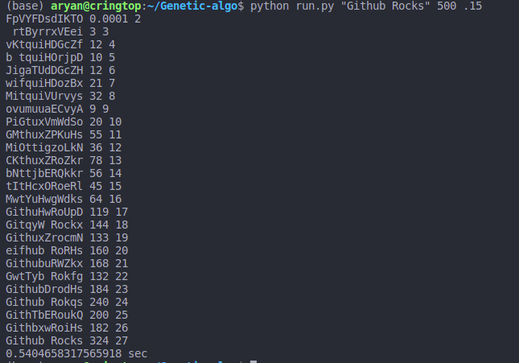

# Genetic-algo

## What is this?
The program tries to guess the given string using a <b>Generic Algorithm</b>. 
Genetic Algorithms much like natural evolution in order to linearly search problems and optimize them.  
A DNA objects holds the strings. They are controled by a population object which manages breeding and the mating pool.

## How does this work?
For every generation of strings a score is assigned to compare them which are then converted into probabilities in the skiwscore. 
DNA objects have a better chance of getting selected as parents if they have a higher probability. 
The breeding function selectes a random pivot and splits the two parents and forms a new dna object.

## How to use it?
Before running the actual file following [Requirements](requirements.txt) have to be installed which can be done by the following: 
` pip install -r requirements.txt` 
Now for running the file you have to provide 3 arguments: 
- a - The string you want to evolve.
- p - The population of each generation during the evolution.
- m - The probability of mutation in the generation. 
` python run.py "target string" "population" "mutation probability"` 
To further dive deeper into the usage you can use the following command: 
`python run.py -h`

## Sample Output
Running the script in the given way will fetch you an output like this: 

## Contribution
The code has been cleaned and restructered by [Aryan](https://github.com/aryankargwal).

## License
Presented repository is under the [MIT License](LICENSE)
